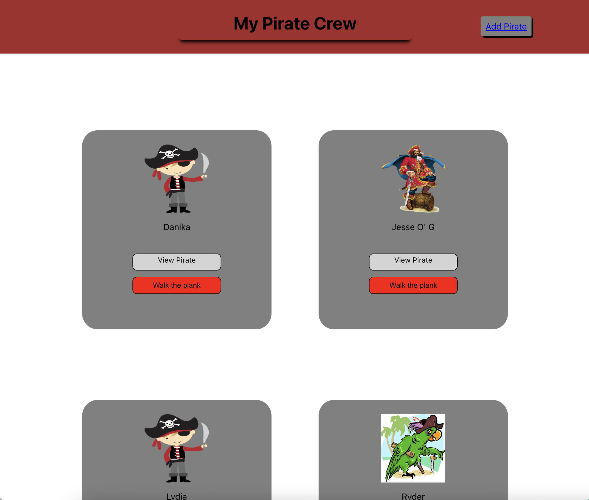
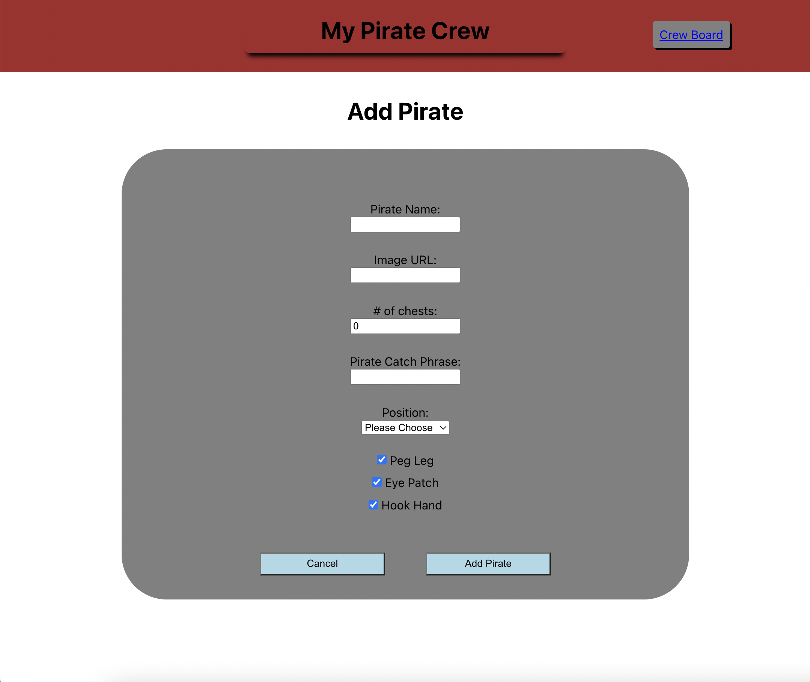
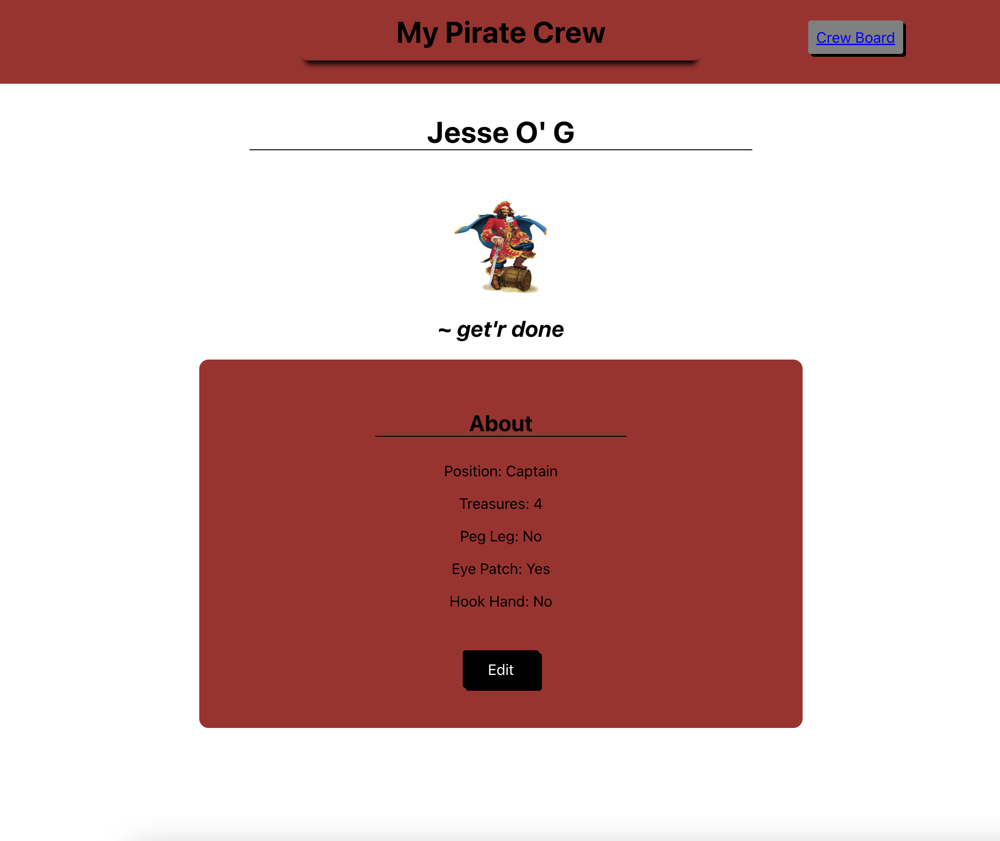
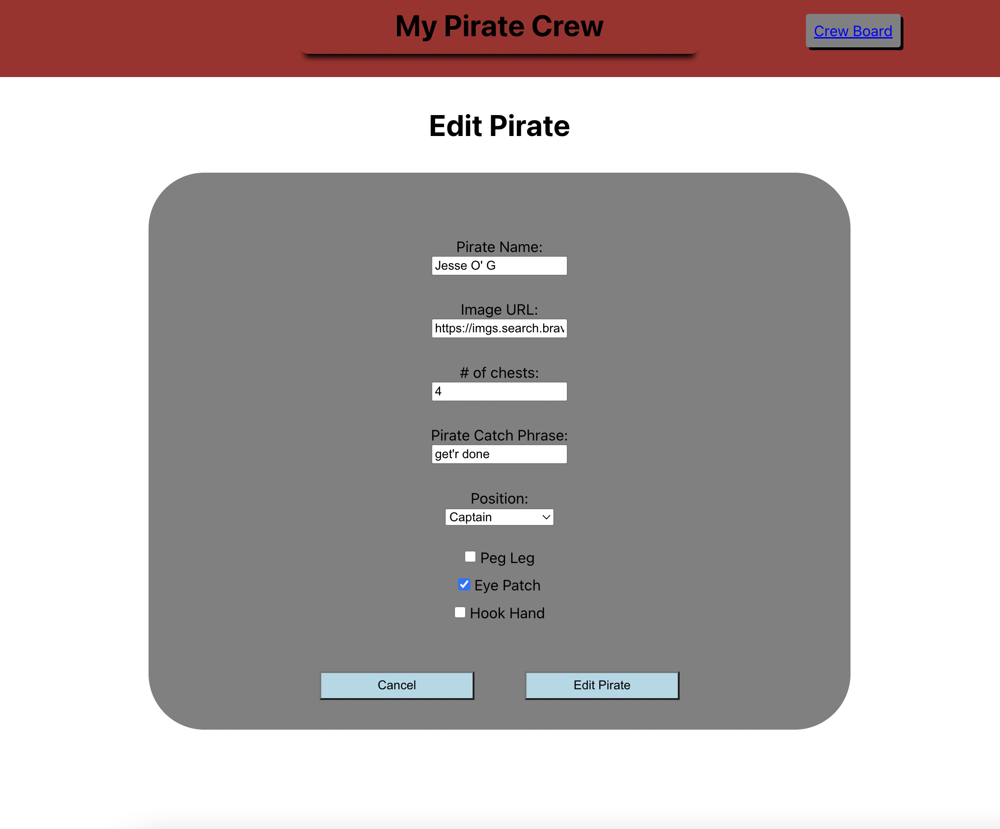

<h1 align='center'> Pirate Crew </h1>

### A Full-Stack CRUD MERN Application

### Features

- Responsive React.js front-end utilizing re-usable components
- Express.js backend with REST api implementation
- MongoDB connection to Mongoose Database with back-end validations

### Summary

With this application you are able to. build collections of users in a 'Priate Crew'. Give your crew members attributes like: an eye patch, a peg leg, or a hook hand! Go wild and bring all your closest 'mates and enjoy the fun! But don't forget their catch phrases!

- This project is a running log of my closest mates, documented for myself. 
  - In the future I will deploy with Vercel to let the community become a part of my Crew!!

- For User's Local Use
  - Anyone can clone this repo and run code locally to build their own pirate crews!
  - Just follow the install instructions and get straight to adding your closest 'mates!

### Photos

- Project Main Page

- Create Form

- Pirate Display Page

- Pirate Edit Page

### How to Run Locally

- Instructions Coming Soon....
